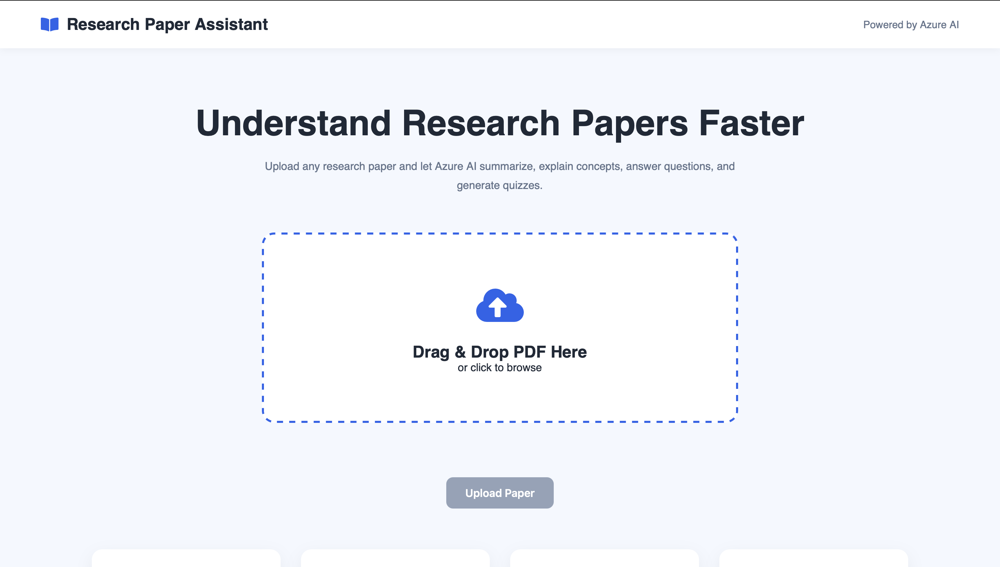
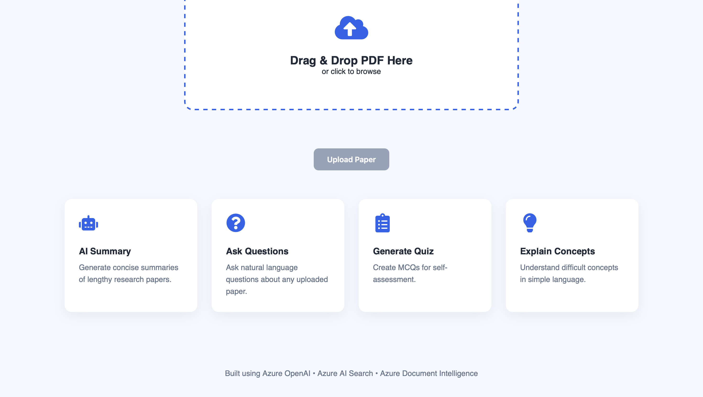
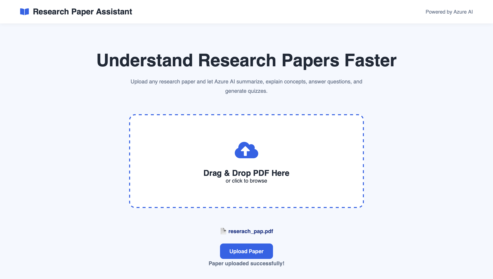
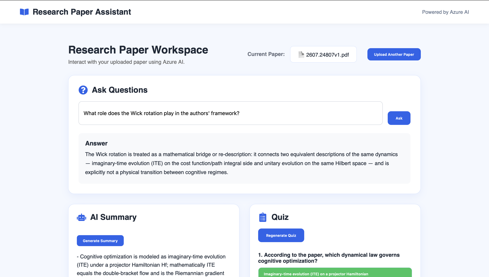
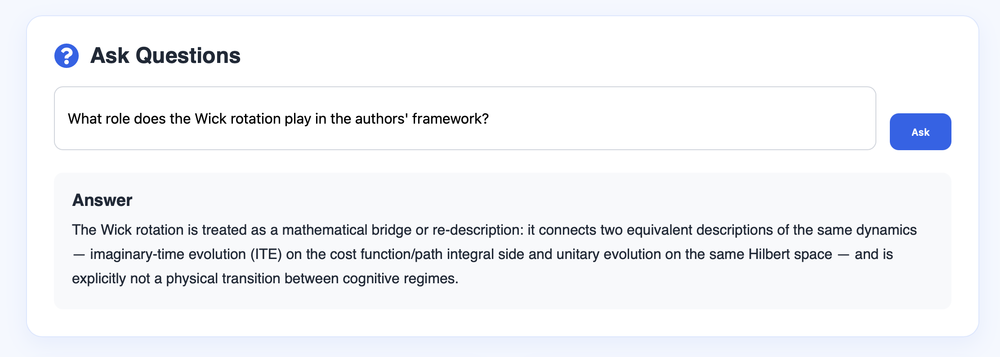
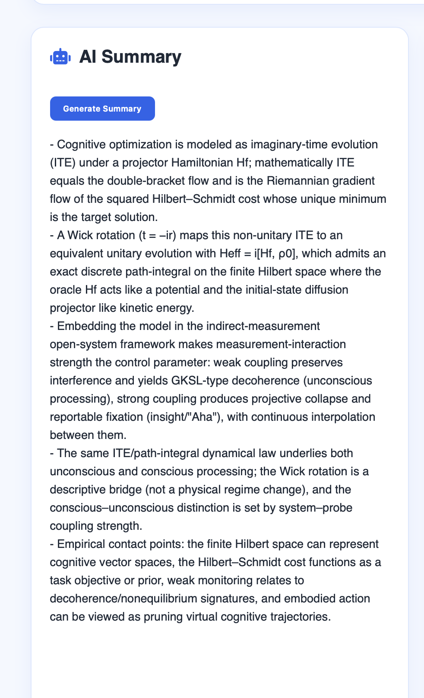
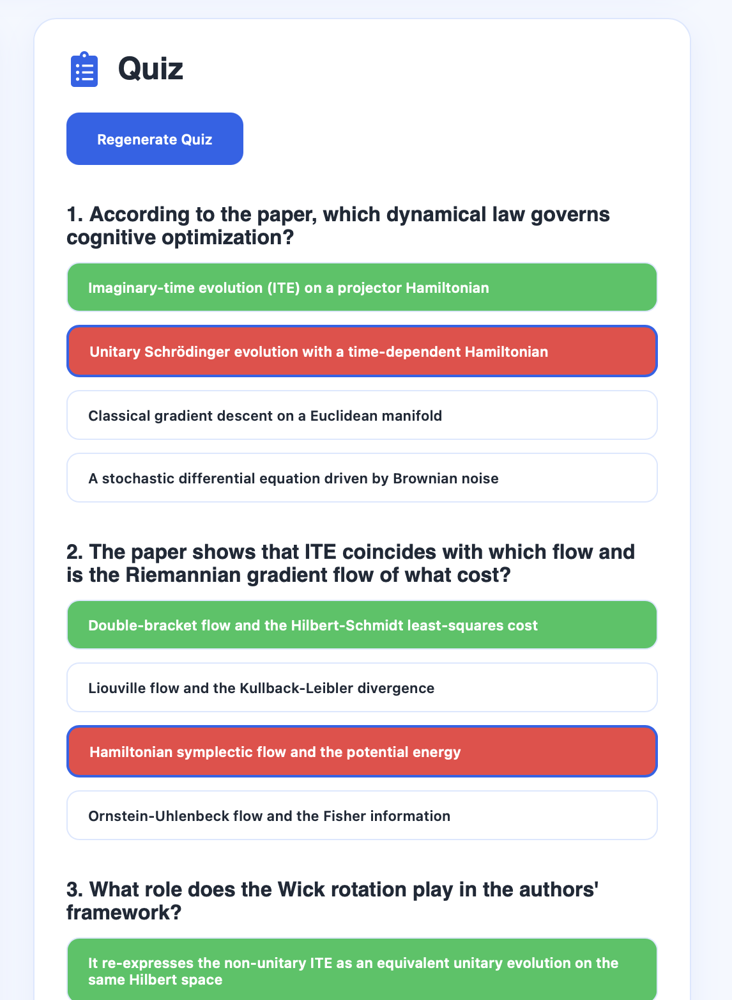
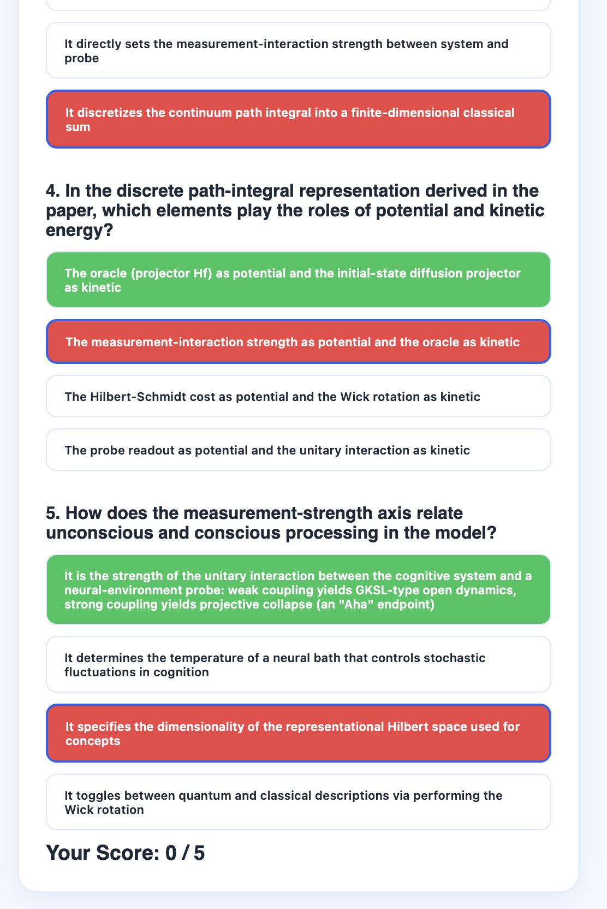

# research-paper-assistant
# 📄 Research Paper Assistant

An AI-powered web application that lets users upload a research paper, ask questions about its content, generate concise summaries, and create quizzes using Retrieval-Augmented Generation (RAG) with Azure AI services.

> **Live Demo:** https://brave-bush-0555fdc00.7.azurestaticapps.net/

---

## ✨ Features

- 📄 Upload research papers (PDF)
- 🤖 Ask questions using RAG
- 📝 Generate concise summaries
- 🎯 Generate quizzes from the paper
- 🔍 Semantic search using Azure AI Search
- ☁️ Cloud-based processing with Azure services
- 📱 Clean and responsive UI

---

## ⚠️ Limitations

This project is a **minimal implementation** of a Research Paper Assistant.

Currently it is designed for:
- Small research papers
- Moderate-length PDFs
- Demonstration and educational purposes

Large research papers may experience:
- Longer response times
- Azure Free Tier limitations
- Incomplete indexing due to service quotas

---

## 🛠 Tech Stack

### Frontend
- React
- Vite
- Axios
- React Icons
- CSS

### Backend
- Azure Functions (Python)
- Azure Blob Storage
- Azure Document Intelligence
- Azure AI Search
- Azure OpenAI

---

## 🏗 Architecture

```
                Upload PDF
                     │
                     ▼
        Azure Blob Storage
                     │
                     ▼
      Azure Document Intelligence
                     │
                     ▼
          Extract Document Text
                     │
                     ▼
            Chunk the Content
                     │
                     ▼
     Azure OpenAI Embeddings
                     │
                     ▼
          Azure AI Search Index
                     │
      ┌──────────────┼──────────────┐
      ▼              ▼              ▼
 Ask Questions    Summary        Quiz
      │              │              │
      └──────────────┼──────────────┘
                     ▼
             Azure OpenAI GPT
                     │
                     ▼
                Response
```

---

## 📂 Project Structure

```
research-paper-assistant/
│
├── frontend/
│   ├── src/
│   ├── public/
│   └── package.json
│
├── api/
│   ├── services/
│   ├── shared/
│   ├── function_app.py
│   └── requirements.txt
│
└── README.md
```

---

## 🚀 Getting Started

### Clone the repository

```bash
git clone https://github.com/PreethiVardhan037/research-paper-assistant.git
cd research-paper-assistant
```

### Frontend

```bash
cd frontend
npm install
npm run dev
```

### Backend

```bash
cd api

python -m venv .venv

source .venv/bin/activate

pip install -r requirements.txt

func start
```

---

## 🔑 Environment Variables

Configure the following variables before running the application:

```
AZURE_STORAGE_CONNECTION_STRING=

BLOB_CONTAINER_NAME=

DOCUMENT_INTELLIGENCE_ENDPOINT=

DOCUMENT_INTELLIGENCE_KEY=

SEARCH_ENDPOINT=

SEARCH_KEY=

SEARCH_INDEX=

AZURE_OPENAI_ENDPOINT=

AZURE_OPENAI_KEY=

AZURE_OPENAI_DEPLOYMENT=

AZURE_OPENAI_EMBEDDING_DEPLOYMENT=
```

---

## 📸 Screenshots

### Home Page






### Upload Paper



### Workspace


### Ask Questions



### Summary Generation



### Quiz Generation





---

## 🌐 Live Demo

https://brave-bush-0555fdc00.7.azurestaticapps.net/

---

## 💡 Future Improvements

- Support large research papers
- Streaming responses
- Conversation history
- Highlight answer sources
- Multi-document search
- Citation-aware responses
- User authentication
- Chat interface
- Export summaries and quizzes
- Improved chunking strategy

---

## 👨‍💻 Author

**Preethi Vardhan**

GitHub: https://github.com/PreethiVardhan037

